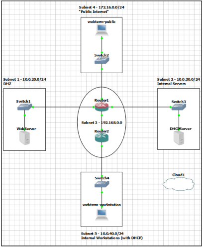
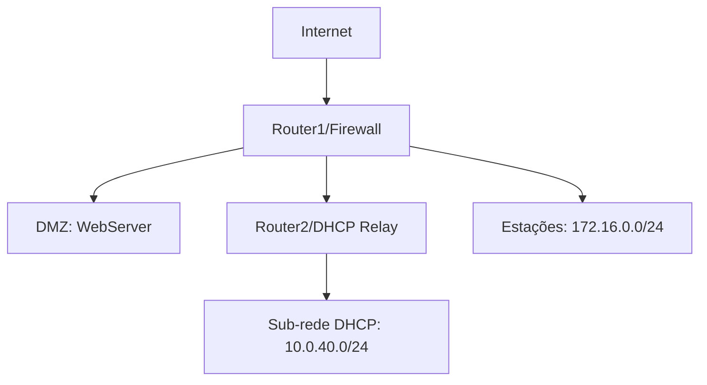

# Implementação de Firewall em Rede Corporativa - CIC0201 (2025/1)

**Simulação de rede segmentada com políticas de segurança**  
*Trabalho de Implementação 3 - Segurança Computacional - Universidade de Brasília*

---

## Sumário
1. [Visão Geral](#-visão-geral)
2. [Arquitetura de Rede](#-arquitetura-de-rede)
3. [Implementação Técnica](#-implementação-técnica)
4. [Testes de Validação](#-testes-de-validação)
5. [Estrutura do Repositório](#-estrutura-do-repositório)
6. [Como Executar](#-como-executar)

---

## Visão Geral

Este projeto emula uma rede corporativa segmentada com:
- **5 sub-redes** com zonas de segurança distintas
- **Firewall** baseado em `iptables`
- **Servidor DHCP** com relay
- **Isolamento de servidor web** na DMZ
- **Configurações automáticas** via `rc.local`

**Tecnologias-chave**:
- GNS3 2.2+ (Emulação de rede)
- VMware Workstation (Máquinas virtuais)
- Debian 11 (Sistema operacional)
- Python3 (Servidores HTTP)
- Wireshark (Análise de tráfego)

---

## Arquitetura de Rede

<div align="center">
  
  <br>
  <em>Topologia completa implementada no GNS3</em>
</div>

### Sub-redes
| Sub-rede         | Função                   | Faixa IP        | Nível de Segurança |
|------------------|--------------------------|-----------------|--------------------|
| Internet         | Simulação pública        | 172.16.0.0/24   | Não confiável       |
| DMZ              | Zona de serviços         | 10.0.30.0/24    | Semi-confiável      |
| Link Interno     | Conexão entre roteadores | 192.168.0.0/24  | Confiável           |
| Estações         | Usuários internos        | 172.16.0.0/24   | Confiável           |
| Clientes DHCP    | Hosts dinâmicos          | 10.0.40.0/24    | Controlado          |

### Dispositivos Principais

---

## Implementação Técnica

A rede foi projetada e emulada com o GNS3, utilizando roteadores Debian e máquinas virtuais no VMware para representar os servidores e estações de trabalho. As configurações dos dispositivos foram automatizadas via scripts rc.local, garantindo que os serviços (como servidores HTTP e DHCP) sejam ativados no boot.

As políticas de firewall foram configuradas no Router1 com o iptables, restringindo o tráfego entre sub-redes com base em regras específicas. Um servidor DHCP na Sub-rede 2 fornece IPs dinamicamente à Sub-rede 5, com o auxílio de um retransmissor DHCP (DHCP Relay) instalado no Router2.

Scripts específicos foram criados para cada nó da rede e podem ser encontrados no diretório scripts/config/.

### Tabela de Regras de Firewall (Router1)

| Nº | Origem          | Destino         | Protocolo | Porta(s) | Ação    | Descrição                                  |
|----|-----------------|-----------------|-----------|----------|---------|--------------------------------------------|
| 1  | ANY             | ANY             | ANY       | ANY      | DROP    | Política padrão FORWARD                    |
| 2  | ANY             | ANY             | ANY       | ANY      | ACCEPT  | Conexões ESTABLISHED/RELATED               |
| 3  | 172.16.0.0/24   | 10.0.20.100     | TCP       | 80       | ACCEPT  | HTTP: Sub-rede 4 → WebServer               |
| 4  | 10.0.40.0/24    | 10.0.20.100     | TCP       | 80       | ACCEPT  | HTTP: Sub-rede 5 → WebServer               |
| 5  | 172.16.0.0/24   | 10.0.30.1       | TCP       | 80       | ACCEPT  | HTTP: Sub-rede 4 → DHCPServer              |
| 6  | 10.0.40.0/24    | 10.0.30.1       | TCP       | 80       | ACCEPT  | HTTP: Sub-rede 5 → DHCPServer              |
| 7  | 172.16.0.0/24   | 172.16.0.254    | TCP       | 80       | ACCEPT  | HTTP: Sub-rede 4 → Router1 (INPUT)         |
| 8  | 10.0.40.0/24    | 10.0.30.1       | UDP       | 68→67    | ACCEPT  | Solicitações DHCP: Sub-rede 5 → DHCPServer |
| 9  | 10.0.30.1       | 10.0.40.0/24    | UDP       | 67→68    | ACCEPT  | Respostas DHCP: DHCPServer → Sub-rede 5    |
| 10 | ANY             | lo              | ANY       | ANY      | ACCEPT  | Tráfego loopback                           |
| 11 | ANY             | Router1         | ICMP      | -        | ACCEPT  | Ping para debug do roteador                |

**Legenda:**
- `68→67` = Porta de origem 68 → Porta de destino 67
- Políticas padrão: `INPUT DROP`, `OUTPUT ACCEPT`, `FORWARD DROP`

### Diagrama de Fluxo
sequenceDiagram
    participant Cliente as Estação (172.16.0.100)
    participant Firewall as Router1
    participant Servidor as WebServer (10.0.30.100)
    Cliente->>Firewall: HTTP GET /
    Firewall->>Servidor: Encaminha requisição
    Servidor-->>Firewall: HTTP 200 OK
    Firewall-->>Cliente: Resposta filtrada

---

## Testes de Validação

As funcionalidades da rede foram validadas com comandos curl, ping e análise dos pacotes capturados no Wireshark.

### Tabela Consolidada de Testes

| Caso de Teste          | Comando                   | Origem          | Resultado Esperado       | Status |
|------------------------|---------------------------|-----------------|--------------------------|--------|
| Acesso WebServer       | `curl http://10.0.20.100` | 172.16.0.0/24   | HTTP 200 OK              | ✅      |
| Obtenção DHCP          | `dhclient -v eth0`        | 10.0.40.0/24    | IP 10.0.40.100-200       | ✅      |
| Bloqueio ICMP          | `ping 10.0.20.100`        | ANY             | 100% packet loss         | ✅      |
| Acesso Admin Router1   | `curl 172.16.0.254`       | 172.16.0.0/24   | Conteúdo HTML            | ✅      |

---

## Estrutura do Repositório

```text
GNS3-NETWORK-EMULATION/
├── captures/                 # Prints e capturas usadas no relatório
├── docs/                     # Proposta e relatório final em PDF
├── scripts/
│   ├── config/               # Scripts de configuração de cada host/roteador
│   │   ├── config-dhcpserver.sh
│   │   ├── config-firewall-router1.sh
│   │   ├── config-router1.sh
│   │   ├── config-router2.sh
│   │   ├── config-webserver.sh
│   │   ├── config-webtermpublic.sh
│   │   ├── dhcpd.conf              # Configuração do servidor DHCP
│   │   └── isc-dhcp-relay          # Configuração do DHCP Relay (Router2)
│   └── rc-local/             # Scripts rc.local para boot automatizado de cada nó
│       ├── rc.local-router1
│       ├── rc.local-router2
│       ├── rc.local-dhcpserver
│       ├── rc.local-webserver
│       └── rc.local-webtermpublic
├── .gitignore
├── gns3_topology.gns3        # Arquivo de topologia do GNS3
└── README.md                 # Este arquivo
```

---

## Como Executar o Projeto

### Pré-requisitos
- [GNS3](https://www.gns3.com/) (versão 2.2 ou superior)
- [VMware Workstation](https://www.vmware.com/br/products/workstation-pro.html) ou Player
- Imagem do [Debian 11](https://www.debian.org/download) para as VMs
- Pacotes básicos: `iptables`, `isc-dhcp-server`, `tcpdump`

### Passo a Passo

1. **Importar a topologia no GNS3**
   ```bash
   # No cliente GNS3:
   File > Open Project > Selecionar 'gns3_topology.gns3'
   ```

2. **Iniciar as máquinas virtuais**
    ```bash
    # No VMware:
    File > Open > Selecionar VM do WebServer/DHCPServer
    ```
3. **Configurar os dispositivos (executar em cada host)**
    ```bash
    # Exemplo para o Router1 (Firewall):
    chmod +x scripts/config/firewall.sh
    ./scripts/config/firewall.sh
    ```
4. **Testar a conectividade**
    ```bash
    # Na estação de trabalho (Webterm):
    ping 10.0.30.1  # Teste básico
    curl http://10.0.20.100  # Teste HTTP
    ```
### Comandos Úteis

| Função                | Comando                     |
|-----------------------|-----------------------------|
| **Firewall**       | `iptables -L -v -n`         |
| **Teste HTTP**     | `curl -v http://10.0.20.100`|
| **DHCP**           | `dhclient -v eth0`          |
| **Captura**       | `tcpdump -i eth0 -w cap.pcap` |
| **Reiniciar rede** | `systemctl restart networking` |

## Autor

Arthur Barbabella – 7º semestre de Ciência da Computação – Universidade de Brasília (UnB)  
E-mail: *[artdelpi@gmail.com]*
